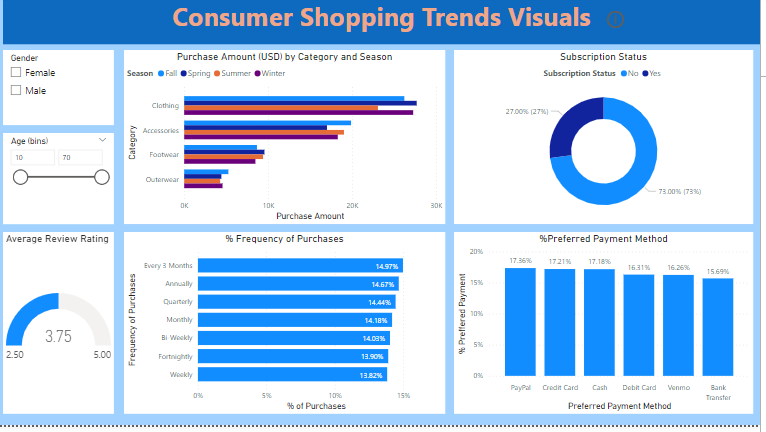

# Tolani Bamidele's Project
[Project 1: Cookies Sales Performance](https://github.com/thurllanie/Thurllanie.Github.io/tree/main)

**The "CookieCo Sales Analysis Dashboard" is a data visualization project that offers comprehensive insights into the sales performance of a fictional cookie company. Leveraging the power of Power BI and utilizing publicly available data from Kaggle, this project demonstrates the capabilities of data analysis and visualization in action.**

The primary goal of this project was to provide an intuitive and interactive dashboard that allows stakeholders to explore various aspects of the company's sales data. With a user-friendly interface, the dashboard enables users to delve into sales trends, product performance, and regional analysis.

This project is a testament to the power of data-driven decision-making and how a well-designed data visualization dashboard can provide valuable insights to support business operations. It showcases skills in data preparation, visualization design, and interactive reporting using Power BI, while also highlighting the use of external data sources from Kaggle to create a compelling story from raw data

[Project 2: Consumer Shopping Trend](https://github.com/thurllanie/Thurllanie.Github.io/tree/main)

**The primary objective of this project was to create a comprehensive dashboard that provides insights into consumer shopping trends, preferences, and patterns. With an easy-to-navigate user interface creted using Powerbi, the dashboard empowers users to uncover meaningful insights from the data.**

The "Consumer Shopping Trends Analysis" project showcases data preparation, visualization design, and interactive reporting skills using Power BI. It serves as a practical example of how businesses can leverage data analytics to optimize marketing strategies, enhance customer satisfaction, and make informed decisions to stay competitive in the marketplace.

This project not only provides valuable insights into consumer shopping trends but also exemplifies the application of data analytics to real-world business scenarios.
